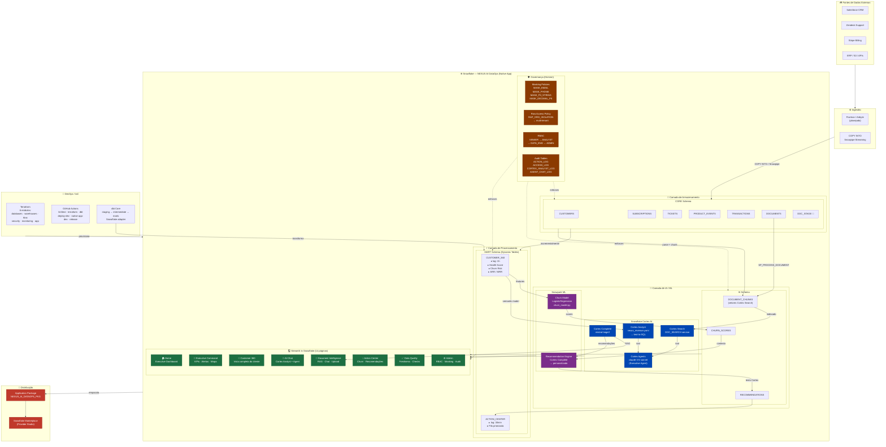

# NEXUS AI DataOps — Arquitetura Técnica

> **Versão:** 1.0.0 · **Data:** 2026-06-16

---

## Modelos de IA utilizados

| Componente | Modelo | Hospedagem | Uso |
|---|---|---|---|
| **Cortex Complete** | `mistral-large2` | Snowflake Cortex | Chat com documentos, resumos, recomendações textuais |
| **Cortex Analyst** | `mistral-large2` | Snowflake Cortex | Geração de SQL a partir de linguagem natural |
| **Cortex Agents (Executive Agent)** | `claude-3-5-sonnet` | Snowflake Cortex | Orquestração multi-tool: dados + documentos |
| **Snowpark ML (Churn)** | `LogisticRegression` | Snowpark ML | Previsão de churn via model training |

> **Importante:** `claude-3-5-sonnet` roda dentro da infraestrutura Snowflake via **Cortex Agents** — não requer conta Anthropic separada. O cliente acessa via API Snowflake com seu próprio token. Verificar modelos disponíveis na sua região em `SHOW MODELS IN SNOWFLAKE.CORTEX`.

---

## Diagrama de Arquitetura



---

## Camadas de Dados — Medallion Architecture

```
Fontes Externas
      │
      ▼
┌─────────────────────────────────┐
│  BRONZE — CORE Schema           │  INSERT/COPY INTO
│  CUSTOMERS · SUBSCRIPTIONS      │  Snowpipe Streaming
│  TICKETS · PRODUCT_EVENTS       │  Fivetran / Airbyte
│  TRANSACTIONS · DOCUMENTS       │
└─────────────────────────────────┘
      │  Dynamic Tables (lag 1h)  ← nativo Snowflake
      │  dbt run --models staging  ← pipeline externo
      ▼
┌─────────────────────────────────┐  ┌──────────────────────────────┐
│  SILVER — STAGING / INTERMEDIATE│  │  dbt Staging (views)         │
│  MART.CUSTOMER_360 (Dynamic)    │  │  stg_customers               │
│  INTERMEDIATE (dbt tables)      │  │  stg_subscriptions           │
│  int_customer_ticket_metrics    │  │  stg_tickets                 │
│  int_customer_usage_metrics     │  │  stg_product_events          │
│  int_customer_subscription_met. │  │  stg_transactions            │
└─────────────────────────────────┘  └──────────────────────────────┘
      │  Snowpark ML + Cortex AI       │  dbt Marts (incremental)
      ▼                                ▼
┌─────────────────────────────────┐  ┌──────────────────────────────┐
│  GOLD — MART Schema             │  │  MART.CUSTOMER_360 (dbt)     │
│  CUSTOMER_360 (Dynamic Tables)  │  │  Health Score · Churn Risk   │
│  ACTION_CENTER (Dynamic / dbt)  │  │  MART.ACTION_CENTER (dbt)    │
└─────────────────────────────────┘  └──────────────────────────────┘
      │  Snowpark ML + Cortex AI
      ▼
┌─────────────────────────────────┐
│  AI — AI Schema                 │  Modelos + Geração
│  DOCUMENT_CHUNKS (embeddings)   │  LogisticRegression churn
│  CHURN_SCORES                   │  Cortex Complete recs
│  RECOMMENDATIONS                │  Cortex Search index
└─────────────────────────────────┘
```

---

## Pipeline dbt

O projeto dbt complementa os Dynamic Tables nativos do Snowflake. É executado externamente (CI/CD, Airflow, dbt Cloud) e escreve nas mesmas tabelas Gold.

| Camada | Materialização | Schema destino | Descrição |
|--------|---------------|----------------|-----------|
| `staging/*` | view | STAGING | Limpeza e normalização das fontes raw |
| `intermediate/*` | table | INTERMEDIATE | Métricas agregadas por cliente (tickets, uso, subscrições) |
| `marts/customer_intelligence/customer_360` | incremental (merge) | MART | Visão 360° Gold com health score e churn risk |
| `marts/action_center/action_center` | table | MART | Fila priorizada de ações ativas |

```
dbt deps          # instala dbt_utils >= 1.0
dbt run           # executa todos os modelos
dbt test          # roda testes de qualidade (unique, not_null, accepted_values, dbt_utils.accepted_range)
dbt run --select mart.customer_intelligence  # executa apenas o mart
```

**Variáveis de projeto** (`dbt_project.yml`):

| Variável | Default | Descrição |
|----------|---------|-----------|
| `org_id` | `ORG-DEMO-001` | Filtro multi-tenant para demo |
| `churn_high_threshold` | `0.70` | Limiar churn HIGH |
| `churn_medium_threshold` | `0.40` | Limiar churn MEDIUM |

**Macros disponíveis** (`macros/health_score.sql`):
- `{{ health_score(...) }}` — fórmula padronizada 35/30/25/10
- `{{ usage_trend(...) }}` — classifica up/stable/down/no_data
- `{{ churn_risk_level(...) }}` — HIGH / MEDIUM / LOW com vars de projeto

---

## Fluxo de IA — Executive Agent

```
Usuário digita pergunta
         │
         ▼
  Cortex Agents API
  POST /api/v2/cortex/agent:run
  model: claude-3-5-sonnet
         │
    ┌────┴────┐
    ▼         ▼
revenue_    document_
analyst     search
(tool)      (tool)
    │         │
    ▼         ▼
Cortex     Cortex
Analyst    Search
nexus_     DOC_SEARCH
revenue    service
.yaml         │
    │         │
    ▼         ▼
SQL gerado  Chunks
+ resultado relevantes
    │         │
    └────┬────┘
         ▼
  Resposta grounded
  com dados + citações
  + recomendação de ação
```

---

## Sprints implementados

| Sprint | Foco | Arquivos-chave |
|--------|------|----------------|
| **1** | Fundação: schemas, roles, sample data, Home dashboard | `01–11_*.sql`, `Home.py` |
| **2** | Customer 360 Dynamic Table + página completa | `12_customer_360.sql`, `2_Customer_360.py` |
| **3** | Document Intelligence: chunking, Cortex Search, chat | `13_document_intelligence.sql`, `4_Document_Intelligence.py` |
| **4** | Cortex Analyst + Executive Agent + AI Chat | `14_cortex_analyst.sql`, `nexus_revenue.yaml`, `executive_agent.yaml`, `3_AI_Chat.py` |
| **5** | Churn Model (Snowpark ML) + Recommendation Engine + Action Center | `15_churn_recs.sql`, `churn_model.py`, `5_Recommendations.py` |
| **6** | RBAC UI, Masking UI, Audit Log, Data Quality, Native App | `16_native_app.sql`, `manifest.yml`, `setup_script.sql`, `6_Data_Quality.py`, `7_Admin.py` |
| **7** | dbt project: staging → intermediate → marts, testes, macros | `dbt/dbt_project.yml`, `dbt/models/**`, `dbt/macros/**`, `dbt/packages.yml` |

---

## Warehouses

| Warehouse | Tamanho | Uso |
|---|---|---|
| `NEXUS_UI_WH` | XS (auto-suspend 60s) | Streamlit UI, queries leves |
| `NEXUS_COMPUTE_WH` | S (auto-suspend 120s) | Dynamic Tables, Tasks, SPs |
| `NEXUS_ML_WH` | M (auto-suspend 300s) | Snowpark ML training |

---

## Multi-tenancy

Cada cliente (organização) é isolada por:
1. **`org_id`** — campo presente em todas as tabelas de dados
2. **`CONFIG.ORG_USER_MAP`** — mapeia usuários Snowflake a organizações
3. **`GOVERNANCE.RAP_ORG_ISOLATION`** — Row Access Policy aplicada em todas as tabelas CORE; bloqueia linhas de outras org_ids em runtime

```
SELECT * FROM CORE.CUSTOMERS
-- Para user 'john@acme.com' → retorna apenas linhas onde org_id = 'ORG-ACME-001'
-- Para NEXUS_ADMIN → retorna todas as linhas
```

---

## Cloud Strategy — Onde cada camada roda

```
Consumer (cliente Snowflake)               Provider (NEXUS team)
────────────────────────────               ──────────────────────
Snowflake on AWS  ┐                        AWS Ingestion Layer
Snowflake on Azure├ ← mesmo Native App →   Lambda, ECS, S3, MWAA
Snowflake on GCP  ┘                        (Fase 1: AWS-first)
```

O Native App roda **dentro do Snowflake do consumer** — cloud-agnostic. A camada de cloud é responsabilidade do provider (ingestão de APIs externas).

| Fase | Infraestrutura | Status |
|------|---------------|--------|
| **1 — MVP** | AWS-first (Lambda + S3 + Airflow/MWAA) | ⚠️ scripts existem, sem triggers |
| **2 — Enterprise** | Suporte a consumers Azure + GCP via External Stages | ❌ não implementado |
| **3 — Escala** | Multi-cloud + Databricks para ML pesado | ❌ planejado |

> Ver detalhes completos em `CLOUD_STRATEGY.md`.

---

## Distribuição — Native App Framework

```
Provider Account (NEXUS)         Consumer Account (Cliente)
──────────────────────────       ──────────────────────────
APPLICATION PACKAGE              INSTALL APPLICATION
NEXUS_AI_DATAOPS_PKG      ──►   NEXUS_AI_DATAOPS
  └─ APP_STAGE/v1/               ├─ Application Roles
      ├─ manifest.yml            │   NEXUS_ADMIN
      ├─ setup_script.sql        │   NEXUS_ANALYST
      └─ streamlit/              │   NEXUS_VIEWER
                                 ├─ Schemas (CORE/MART/AI/AUDIT/GOVERNANCE/CONFIG)
                                 ├─ Streamlit App (14 páginas)
                                 └─ Cortex integrations
                                    (dados nunca saem do
                                     account do cliente)
```

---

## Status atual — Gaps conhecidos

> ⚠️ Esta seção foi originalmente escrita em 2026-06-19 e ficou defasada rápido — vários P0 daquela lista já foram resolvidos pelos commits seguintes. Tabela abaixo atualizada para refletir o estado real; ver [`README.md`](README.md#known-limitations) para a lista viva.

| Prioridade | Gap | Status |
|---|---|---|
| ~~**P0**~~ | `manifest.yml` sem `references:` | ✅ Resolvido — `manifest.yml` já declara `references:` (customer_table, transactions_table, events_table) com `register_callback: core.register_reference` |
| ~~**P0**~~ | Row Access Policy não criada no Native App | ✅ Resolvido — `GOVERNANCE.RAP_ORG_ISOLATION` ativa no `setup_script.sql`, incluindo fix para não bloquear refresh de Dynamic Tables (usuário SYSTEM) |
| **P0** | External Access Integration inativo | Ainda pendente — pipelines de ingestão externa não rodam de dentro do Native App |
| **P1** | Zero Airflow DAGs | ✅ Resolvido — DAGs para Salesforce, Zendesk, Stripe, SAP, Oracle, HubSpot + kbs_refresh existem em `airflow/dags/`, rodando do lado do provider (fora do Native App); sem trigger automático além de execução manual |
| **P1** | KBS (8 Knowledge Bases) ausente | Parcial — `pipelines/kbs/` e `KBS.KB_SEARCH_SERVICE` (Cortex Search) implementados; cobertura das 8 KBs planejadas não confirmada |
| **P1** | Dynamic Tables fora do `setup_script` | ✅ Resolvido — Dynamic Tables do MART fazem parte do `setup_script.sql` |
| **P2** | External Stages S3/Azure/GCS ausentes | Ainda pendente — ver `CLOUD_STRATEGY.md` |
| **P0 (novo)** | Testes de asserção SQL não passam de forma confiável | `tests/sql/*.sql` roda em CI com `continue-on-error: true`; bugs conhecidos em views de `INFORMATION_SCHEMA` e sintaxe `CALL CORE.ASSERT(...)` |
| **P1 (novo)** | CI usa `ACCOUNTADMIN` + senha + `insecure_mode=true` | Débito técnico documentado inline em `.github/workflows/ci.yml`; não é key-pair nem least-privilege |

> Ver análise histórica: `.claude/sdd/reports/GAP_ANALYSIS_2026-06-19.md` (mantida como registro, não como fonte de verdade atual)
> Ver estratégia de cloud: `CLOUD_STRATEGY.md`
